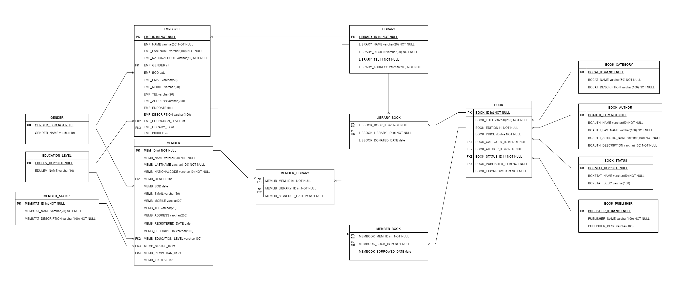

# Library Management System

## Description
A library management system built with Java and the Spring framework.
We have three main entities in this system includes : Book, Library, Member, Employee

## ERD diagram

## Features
- [ ] User registration and login
- [ ] Hiring employees
- [ ] Book management(Donating, borrowing)
- [ ] Borrowing and returning books
- [ ] Search functionality
- [ ] User roles (e.g., admin, librarian, member)

## Technologies Used
- Java
- Spring Framework
  - Spring boot
  - Spring Web
  - Spring Data JPA (Hibernate)
- PostgreSQL as a database for system

## Getting Started
1. Clone the repository: `git clone https://github.com/your-username/library-management-system.git`
2. Build the project using your favorite IDE or build tools.
3. Run the application.
4. Access the application through [localhost:8080](http://localhost:8080).

## Usage
Once the application is running, you can perform the following actions:
- Register as a user.
- Hire an employee
- Browse and search for books.
- Borrow and return books.
- Donate books

## Contributions
Contributions are welcome! If you find any issues or have suggestions for improvement, please submit a pull request.

## License
This project is licensed under the [MIT License](LICENSE).

## Contact
If you have any questions or feedback, feel free to reach out to me.

